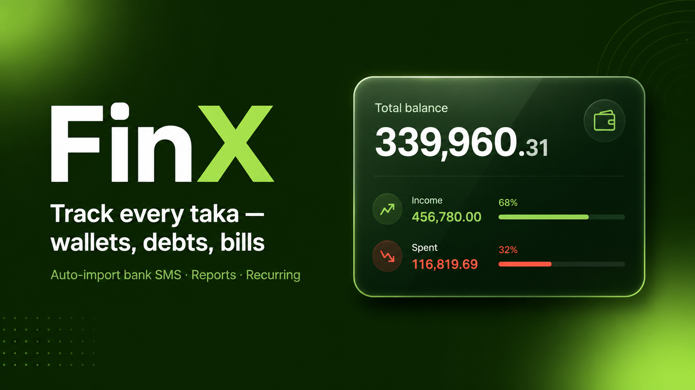

  

# FinX

A simple money tracker for your phone. Keep an eye on what you earn, what you
spend, and who owes you — all in one place.

**Everything stays on your phone.** No sign-up, no account, no cloud. Your money
is your business.

## What you can do

- **Wallets** — Make a wallet for each place you keep money (cash, bank, mobile
  wallet) and see the balance of each one.
- **Income & expenses** — Log money coming in and going out. Your wallet balances
  update on their own.
- **Move money between wallets** — Shift money from one wallet to another in a
  single tap, without it counting as income or spending.
- **Lending & borrowing** — Keep track of money you lend to or borrow from
  people, and tick it off as it gets paid back.
- **Snap a receipt** — Attach a photo to any transaction, straight from your
  camera or photo gallery, so you never lose a record.
- **Automatic bank SMS** *(Android only)* — Let FinX read your bank and bKash
  text messages and add the transactions for you. Works with **City Bank**,
  **Standard Chartered**, and **bKash**. You choose which wallet each one feeds.
- **See where your money goes** — Browse your activity by week, month, year, or
  any date range you pick.
- **Locked and private** — Open the app with a 4-digit PIN, or your fingerprint /
  face. Forgot your PIN? Unlock with your fingerprint and set a new one — your
  data is never wiped.
- **Backup & restore** — Save all your data to a single file, and load it back
  any time. Great for moving to a new phone.

## Get the app

Grab the latest Android APK from the
[Releases page](https://github.com/shahriyardx/finx/releases), download it to
your phone, and tap to install.

> You may need to allow "install from unknown sources" the first time — your
> phone will guide you through it.

## Set it up

1. Open FinX and pick a 4-digit PIN.
2. (Optional) Turn on fingerprint / face unlock in **Settings**.
3. Add your first wallet and start logging money.

That's it. No account to create, nothing to sign up for.

## A note on privacy

FinX never sends your data anywhere. There's no server, no analytics, no
tracking. The bank SMS feature reads messages only on your phone to fill in
transactions — those messages never leave your device.

---

*Built with [Expo](https://expo.dev). Developers: see
[AGENTS.md](AGENTS.md) and the in-repo docs for the technical details.*
